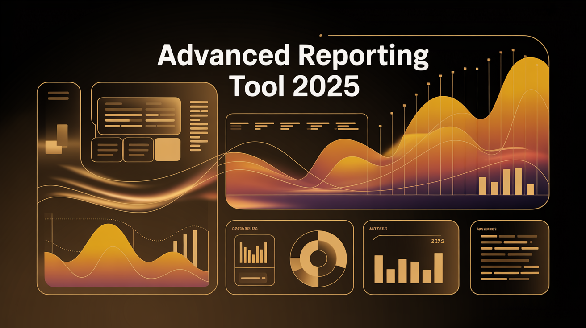

# System Report Tool 2025

## Description

This project provides a PowerShell script designed to generate a comprehensive
system report, providing detailed information about the system's hardware,
software, and configuration.

## Features

- **Administrator Privilege Check:** Ensures the script runs with administrator
  privileges, restarting itself with elevation if necessary.
- **Comprehensive System Report Generation:** Gathers and presents a wide range
  of system information.
- **Report Sections:**
  - Windows Update Status (pending updates and last installed update)
  - System Information (manufacturer, model, OS name, OS version, processor,
    BIOS)
  - Memory Information (total RAM, memory slots)
  - Disk Information (drive information, size, free space)
  - Graphics Information (video controller information)
  - Network Information (network adapter information)
  - Power and Battery Information
  - System Uptime
  - Startup Programs
  - Installed Software
  - Finds and lists large files (larger than 0.1 GB)
- **Output:** Saves the report to a text file on the user's desktop.
- **Speech Output:** Provides speech output for key information, such as the
  report generation status and key findings.
- **User Prompt:** Prompts the user to open the generated report.

## Dependencies

- PowerShell
- System.Speech (for speech output)

## Installation

1. Ensure PowerShell is installed on your system. (It is typically pre-installed
   on Windows systems.)
2. Save the `SYSTEM-REPORT-TOOL.ps1` script to a directory of your choice.

## Usage

1. Open PowerShell as an administrator. (The script will attempt to elevate
   itself if run without admin privileges.)
2. Navigate to the directory where you saved the script.
3. Run the script using the command: `.\SYSTEM-REPORT-TOOL.ps1`.
4. The script will generate a comprehensive system report and save it to a text
   file named "COMPREHENSIVE SYSTEM REPORT - by JTG Systems.txt" on your
   desktop.
5. The script will provide speech output and prompt you to open the report.

## Configuration

The following variables can be modified within the script to customize its
behavior:

- `$outputFile`: Specifies the path to the output report file. Defaults to
  `$env:USERPROFILE\Desktop\COMPREHENSIVE SYSTEM REPORT - by JTG Systems.txt`
  (your desktop).
- `$minSizeGB`: Specifies the minimum size (in GB) for files to be considered
  "large" in the large files report. Defaults to `0.1`.

## Robust Data Acquisition Methodology

The System Report Tool 2025 employs a methodology designed to acquire system
data reliably and comprehensively. The following principles are applied:

- **Error Handling:** Each data acquisition task is enclosed in `try-catch`
  blocks to handle potential errors gracefully. This prevents the script from
  crashing and ensures that the report includes as much information as possible,
  even if some data sources are unavailable. Specific error messages are
  provided where possible.
- **Data Source Prioritization:** The script prioritizes the use of modern
  PowerShell cmdlets and WMI/CIM for data retrieval. Where possible, deprecated
  methods are avoided in favor of more reliable and efficient alternatives.
- **Performance Optimization:** The script uses background jobs (`Start-Job`) to
  collect data concurrently, improving overall performance. The large file
  search is optimized by limiting the number of files returned.
- **Data Validation:** The script validates data where appropriate (e.g.,
  checking for null values) to ensure data integrity.
- **Specific Data Acquisition Methods:**
  - **Windows Update Status:** Uses the `Microsoft.Update.Session` COM object.
    Future improvements could include using the `Get-WindowsUpdateLog` cmdlet or
    other more modern methods.
  - **System Information, Memory Information, Disk Information, Graphics
    Information, Startup Programs:** Uses `Get-CimInstance` to retrieve
    information from WMI/CIM. Error handling is implemented.
  - **Network Information:** Uses `Get-NetAdapter`. Error handling is
    implemented.
  - **Power and Battery Information:** Uses `powercfg /GetActiveScheme` and
    `Get-CimInstance` (Win32_Battery). Error handling is implemented.
  - **System Uptime:** Calculates uptime based on the last boot time.
  - **Installed Software:** Uses `Get-CimInstance` (Win32_Product). This method
    can be slow and unreliable. Future improvements could include using
    alternative methods for retrieving installed software information, such as
    querying the registry or using the `Get-Package` cmdlet (if available).
  - **FindLargeFiles:** Uses `Get-ChildItem` to search for large files. The
    search is limited to the user's profile directory and the top 50 largest
    files are returned.

## Attribution

Credit: [https://www.jtgsystems.com](https://www.jtgsystems.com)
